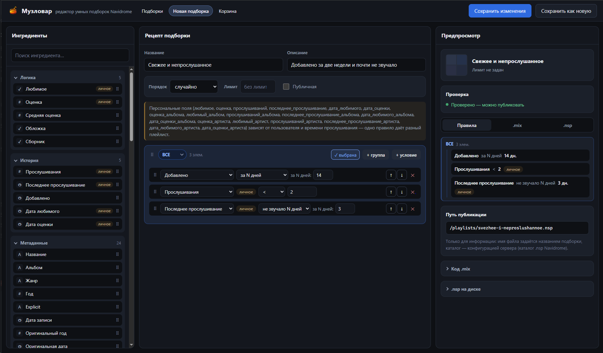

[English](README.md) | Русский

# Muzlovar

[](https://github.com/zamyatinmn/muzlovar/actions/workflows/ci.yml)

**Визуальный редактор умных подборок для Navidrome, который можно разместить на своём сервере.**

Muzlovar помогает создавать [умные подборки Navidrome](https://www.navidrome.org/docs/usage/features/smart-playlists/) без ручного написания `.nsp` JSON. В браузере вы составляете рецепт из условий, видите результат в `.mix` и `.nsp`, проверяете правила и публикуете файлы в каталог подборок Navidrome.

Редактор и CLI **Nspeller** используют одно ядро на Haskell: реестр полей, типизированное дерево правил, проверку и генерацию файлов. JavaScript отвечает за работу интерфейса, но не содержит второго компилятора `.nsp`.

**Язык:** веб-интерфейс Muzlovar и синтаксис DSL Nspeller сейчас русскоязычные. Английской локализации интерфейса пока нет; ниже показан действующий интерфейс.

## Возможности

- Сборка правил из «ингредиентов»: вложенные группы **ВСЕ/ЛЮБОЕ**, поиск, управление с клавиатуры и перетаскивание мышью.
- Предпросмотр канонических `.mix` и `.nsp` с проверкой правил на сервере.
- Условия по метаданным, истории прослушивания, оценкам, любимому, статистике альбомов и исполнителей, свойствам аудиофайлов, идентификаторам и другим подборкам.
- Надёжная публикация: проверка конфликтов, атомарная замена файлов, контроль принадлежности созданных файлов и откат при ошибке записи.
- Переименование, сохранение как новой подборки, удаление в Корзину, восстановление и окончательное удаление.
- Просмотр внешних `.nsp` с неподдерживаемыми конструкциями в режиме только для чтения.
- Необязательная Basic Auth и интеграция с Subsonic API для поиска и удаления соответствующей сущности подборки в Navidrome.
- Docker-образ с непривилегированным процессом, CLI Nspeller, тесты Haskell и браузерные E2E-тесты.



## Быстрый запуск через Docker

После первого релизного тега готовый образ будет доступен как [`ghcr.io/zamyatinmn/muzlovar`](https://github.com/zamyatinmn/muzlovar/pkgs/container/muzlovar). Для запуска не нужны GHC и Cabal.

Скачать образ напрямую:

```bash
docker pull ghcr.io/zamyatinmn/muzlovar:latest
```

Запустить с готовой конфигурацией Compose:

```bash
git clone https://github.com/zamyatinmn/muzlovar.git
cd muzlovar
docker compose up -d
```

Откройте <http://localhost:8765>. Основной [`docker-compose.yaml`](docker-compose.yaml) использует готовый образ и именованные тома Docker. После публикации первого образа достаточно свежего клона: собирать проект и заранее создавать каталоги на хосте не требуется.

| Том Docker | Путь в контейнере | Назначение |
| --- | --- | --- |
| `muzlovar_rules` | `/rules` | Исходные правила `.mix` |
| `muzlovar_playlists` | `/playlists` | Опубликованные файлы `.nsp` |
| `muzlovar_trash` | `/trash` | Корзина для восстановления удалённых файлов |

Без дополнительных настроек авторизация выключена. Если сервис будет доступен вне доверенной сети, скопируйте [`.env.example`](.env.example) в `.env`, задайте оба значения `MUZLOVAR_USERNAME` и `MUZLOVAR_PASSWORD` и используйте reverse proxy с HTTPS.

Чтобы Navidrome увидел опубликованные подборки, подключите том `muzlovar_playlists` к его `PlaylistsPath` либо замените именованный том в Compose на bind mount существующего каталога подборок. Контейнер работает от UID `10001`: при bind mount этот пользователь должен иметь право записи в каталог.

```yaml
services:
  navidrome:
    volumes:
      - muzlovar_playlists:/playlists
    environment:
      ND_PLAYLISTSPATH: /playlists

volumes:
  muzlovar_playlists:
    name: muzlovar_playlists
```

В образ входят `muzlovar` и `nspeller`; GHC и Cabal остаются только на этапе сборки. Рабочий процесс непривилегирован, а `tini` передаёт ему сигналы остановки. Проверка состояния контейнера вызывает `GET /health`.

### Сборка контейнера из исходников

Для локальной разработки используйте Compose override:

```bash
docker compose -f docker-compose.yaml -f docker-compose.dev.yaml up -d --build
```

[`docker-compose.dev.yaml`](docker-compose.dev.yaml) собирает тот же production Dockerfile локально и присваивает образу имя `muzlovar:local`. В GHCR эта команда ничего не отправляет.

## Как это устроено

```text
Данные визуального редактора ─┐
                              ├─> типизированный AST Haskell -> проверка -> канонический .mix
Русскоязычный DSL .mix ────────┘                                                |
                                                                                 v
                                                                   модель Navidrome -> .nsp JSON
```

Реестр полей — общий источник названий и типов полей, допустимых операторов, числовых ограничений, групп «ингредиентов» и возможностей сортировки. `/api/schema` отдаёт эту схему интерфейсу. `/api/validate` преобразует данные редактора в тот же типизированный AST, которым пользуется Nspeller, и возвращает предпросмотр `.mix` и `.nsp` без записи на диск.

Страницы Muzlovar формируются сервером на Scotty и Lucid; в браузере работают обычные JavaScript и CSS. Клиентского фреймворка и зависимости от Node.js при запуске сервера нет.

## Интерфейс

В Muzlovar три основных экрана:

- **Подборки** — список `.mix` и `.nsp` с описанием, кратким содержанием правил, состоянием публикации, временем изменения и статусом `managed`, `external` или `broken`.
- **Новая подборка / редактор** — палитра ингредиентов, дерево правил, порядок и лимит, результат проверки и предпросмотр `.mix`/`.nsp`. Опубликованную подборку можно обновить, переименовать или сохранить как новую.
- **Корзина** — восстановление удалённых подборок и окончательное удаление.

При удалении Muzlovar переносит управляемые файлы в Корзину, не редактируя базу данных Navidrome напрямую. Если заданы все три параметра Subsonic, приложение также может вызвать `deletePlaylist`. Без них при необходимости удалите импортированную сущность через интерфейс Navidrome.

Поля «Любимое», «Прослушивания», оценки и даты последнего прослушивания Navidrome вычисляет для владельца подборки. Поэтому один и тот же `.nsp` может дать разный результат у разных владельцев.

## Настройка

| Переменная | По умолчанию | Назначение |
| --- | --- | --- |
| `MUZLOVAR_USERNAME` | не задана | Имя пользователя Basic Auth; требуется вместе с паролем |
| `MUZLOVAR_PASSWORD` | не задана | Пароль Basic Auth; требуется вместе с именем пользователя |
| `MUZLOVAR_RULES_DIR` | `./rules` | Каталог исходных `.mix` |
| `MUZLOVAR_PLAYLISTS_DIR` | `./playlists` | Каталог опубликованных `.nsp`, обычно `PlaylistsPath` Navidrome |
| `MUZLOVAR_TRASH_DIR` | `./trash` | Каталог Корзины |
| `MUZLOVAR_PORT` | `8765` | HTTP-порт от 1 до 65535 |
| `MUZLOVAR_HOST` | `*` | Адрес прослушивания |
| `MUZLOVAR_SUBSONIC_URL` | не задана | Базовый URL Subsonic API |
| `MUZLOVAR_SUBSONIC_USER` | не задана | Имя пользователя Subsonic |
| `MUZLOVAR_SUBSONIC_PASSWORD` | не задана | Пароль Subsonic |

Basic Auth включается только при непустых имени пользователя и пароле. Если не задано ни одно значение, авторизация выключена; если задано только одно, приложение не запустится. `/health` и `/static/*` остаются общедоступными и при включённой авторизации.

Адаптер Subsonic включается только при наличии URL, имени пользователя и пароля. Учётные данные и параметры URL удаляются из сообщений об ошибках соединения.

### Запуск из исходников

Нужны GHC 9.6 или новее (контейнер и CI используют 9.10.3), Cabal 3.10 или новее и доступ к Hackage при первой сборке.

```bash
cabal build
cabal run exe:muzlovar
```

При локальном запуске сервер использует `./rules`, `./playlists` и `./trash`, если переменные окружения не заданы. Адрес: <http://127.0.0.1:8765/>.

Релизные теги вида `vX.Y.Z` публикуют образ для `linux/amd64`. Например, `v1.2.3` создаёт теги `1.2.3`, `1.2`, `1` и `latest`. Обычный push в `master` образ не публикует. Сборка ARM64 пока не проходит из-за зависимости `crypton`, поэтому этот вариант образа не заявлен.

## Nspeller — компилятор правил

Nspeller преобразует человекочитаемые правила `.mix` в `.nsp` JSON для Navidrome. Ключевые слова DSL русские; файлы сохраняются в UTF-8 и допускают комментарии после `#`. Англоязычного синтаксиса DSL сейчас нет.

```text
подборка "Забытое любимое"
описание "Любимые треки, которые давно не звучали"

где все {
  любимое
  прослушиваний > 2
  не звучало 90 дней
}

порядок случайный
лимит 100
```

### CLI

```bash
# Проверить файл без записи результата
nspeller check examples/forgotten.mix

# Скомпилировать рядом с исходным файлом
nspeller build examples/forgotten.mix

# Скомпилировать по указанному пути
nspeller build examples/forgotten.mix --output /path/to/forgotten.nsp

# Проверить все *.mix непосредственно в каталоге и собрать пакет
nspeller build-all ./rules --output ./playlists
```

`build-all` не обходит вложенные каталоги. Если какой-либо исходник невалиден, команда сообщает все ошибки и не меняет выходные файлы. Успешная запись выполняется через временный файл в целевом каталоге с последующим переименованием; устаревшие `.nsp`, которым больше нет соответствующего `.mix`, автоматически не удаляются.

### Структура DSL

В файле обязательны ровно одна секция `подборка` с названием и одна секция `где` с правилами. Необязательные секции: `описание`, `публичная`, `порядок`, `лимит`. Секции можно располагать в любом порядке. Группы `все` и `любое` соответствуют узлам Navidrome `all` и `any` и могут вкладываться друг в друга.

Поддерживаются сравнения текста, чисел и дат, диапазоны, проверки наличия там, где они предусмотрены Navidrome, относительные даты, ссылки на другие подборки и сокращение `любимое`. Совместимость поля и оператора проверяется до генерации JSON. Произвольные пользовательские поля и динамические теги Navidrome не поддерживаются.

Подробные таблицы полей, матрица операторов, грамматика, ограничения значений, предупреждения, примеры, формат JSON и устройство типизированного AST сохранены в [полном справочнике Nspeller](docs/nspeller-reference.ru.md). Готовые пары `.mix`/`.nsp` находятся в каталоге [`examples/`](examples/).

### Проверка и результат

Валидация собирает все ошибки файла: отсутствие или повтор обязательных секций, несовместимые поля и операторы, неверные типы и диапазоны значений, недопустимую сортировку, пустые ссылки на подборки, противоречивые числовые условия и неположительный лимит. Предупреждения, не мешающие компиляции, сообщают о точных повторах, лишних границах и условиях, покрывающих всю известную область значений.

После проверки типизированный AST не позволяет представить несовместимую пару поля и оператора. Выходной `.nsp` — обычный JSON без комментариев: отсутствующие необязательные ключи опускаются, форматирование детерминировано, отступ составляет два пробела, файл завершается переводом строки.

## HTTP API

- `GET /api/schema` — поля, операторы, ограничения и группы палитры из реестра Haskell.
- `GET /api/playlists` и `GET /api/playlists/:slug` — список и подробности подборок.
- `POST /api/validate` — проверка с предпросмотром `.mix` и `.nsp`, без записи на диск.
- `POST /api/playlists` — публикация новой подборки.
- `PUT /api/playlists/:slug[?overwrite=1]` — обновление или переименование управляемой подборки.
- `DELETE /api/playlists/:slug` — перенос управляемой подборки в Корзину.
- `GET /api/trash`, `POST /api/trash/:id/restore`, `DELETE /api/trash/:id` — операции с Корзиной.
- `GET /health` — общедоступная проверка работы сервера.

При публикации Muzlovar записывает связанную пару `.mix` и `.nsp`. Служебный файл `.muzlovar-published.json` хранит пути и FNV-1a-хеши записанных байтов. При переименовании старые файлы удаляются только если эта запись всё ещё им соответствует: изменённые извне, чужие, символьные ссылки и пути за пределами каталога блокируют очистку.

## Тесты

```bash
cabal test all
cabal build all
```

Набор Haskell включает unit-, golden-, property- и интеграционные тесты: преобразования DTO/AST, согласованность схемы с валидатором, безопасную запись файлов, состояния подборок, Basic Auth, HTTP API, переименование и жизненный цикл Корзины.

Для браузерных E2E-тестов нужны Node.js и локальный Chrome/Chromium:

```bash
cd muzlovar/e2e
npm ci
npm test
npm run test:publish-rename
npm run test:save-as-new
```

Если браузер не найден автоматически, укажите `MUZLOVAR_E2E_CHROME`. Чтобы использовать уже собранный executable `muzlovar`, задайте `MUZLOVAR_E2E_SKIP_BUILD=1`.

## Ограничения

- Muzlovar хранит данные в файлах; собственной базы данных и наблюдателя за изменениями файлов у него нет.
- Через Subsonic API он только ищет и удаляет сущность подборки. Создание и обновление выполняются записью `.nsp` для сканирования Navidrome.
- Интерфейс, сообщения об ошибках и ключевые слова DSL сейчас русскоязычные; английской локализации UI нет.
- Анализа музыкальных файлов, рекомендательной системы, ML, Android-интеграции и рекурсивного `build-all` нет.
- `limitPercent`, общего отрицания, списков значений и произвольных пользовательских полей Navidrome нет.
- Внешние `.nsp` с конструкциями, которые нельзя выразить в DSL, доступны только для чтения.

## Структура проекта

```text
app/                         точка входа CLI Nspeller
muzlovar/                    executable Muzlovar, статические файлы и E2E-тесты
src/Nspeller/                парсер, типизированная модель, проверка, генерация, CLI
src/Nspeller/Muzlovar/       сервер, HTML, файловое хранилище, DTO, адаптер Subsonic
examples/                    примеры .mix и ожидаемых .nsp
test/                        unit-, golden-, property- и интеграционные тесты Haskell
docs/nspeller-reference.ru.md подробный русскоязычный справочник
```

## Участие в разработке и безопасность

Порядок работы с проектом описан в [`CONTRIBUTING.md`](CONTRIBUTING.md). О найденных уязвимостях сообщайте способом, указанным в [`SECURITY.md`](SECURITY.md), а не через публичный issue.

Muzlovar и Nspeller распространяются по [лицензии MIT](LICENSE).
